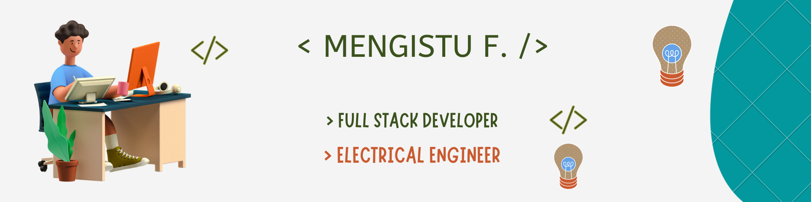

<h3 align="center" >Hi there 👋, `I'm Mengstu</h3>

<h2 align="center">I am Full Stack Developer, Electrical Engineer</h2>

`I do front-end and back-end web development. I'm also electrical engineer who enjoys to work in embedded electronics and power electronics & drives design.I really enjoy learning new programming languages and frameworks like React. I enjoy challenging myself and learn from it.`

### `💼 Technical Skills`
 

### `🤝 Connect with me`
 

### ` 📈 GitHub Stats `
 

### `GitHub Metrics`
 

  
